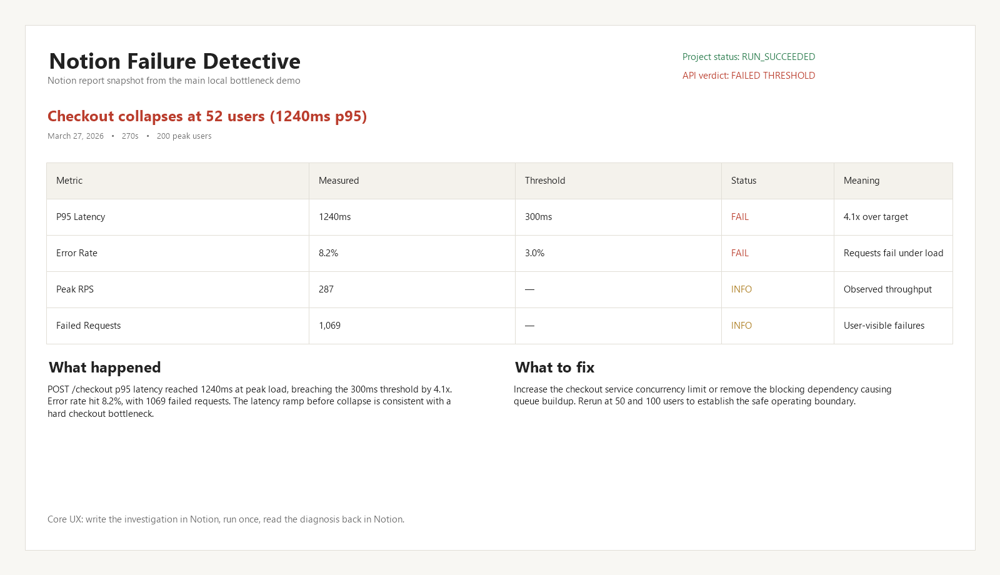

# Notion Failure Detective

Notion Failure Detective is a Node.js application that reads an investigation spec from Notion through Notion MCP, runs a k6-based API investigation in Docker, and writes the results and diagnosis back to Notion.

The product focus is production failure investigation, not a standalone load-testing dashboard. Notion is the primary interface for defining what to investigate and for reading the final report.

## Why This Is Different

Most tools stop at running traffic. This one closes the loop inside Notion:

- write the investigation in plain English in a Notion page
- run the investigation
- read the structured diagnosis back in Notion

That makes Notion MCP load-bearing, not decorative.

## Hero Demo

Primary showcase: the local bottleneck demo.

Main local demo story:

- you write the API investigation in Notion
- the system reads it through MCP
- it runs the checkout flow under load
- it writes back the result, root cause, and next action in Notion

Hero example from the local bottleneck scenario:



This is the strongest product moment in the project:

- plain-English spec in Notion
- one run
- a structured investigation report back in Notion

## Overview

The system supports this end-to-end workflow:

1. Read a plain-English test spec from a Notion page.
2. Extract the target URL, endpoints, load profile, and thresholds.
3. Generate and validate a k6 script.
4. Execute the script in Docker.
5. Parse summary metrics from k6 output.
6. Generate a diagnosis with Groq, with deterministic fallbacks.
7. Write the structured result and a report page back to Notion.

## Current Implementation

- Runtime: Node.js + Express
- Notion integration: Notion MCP via `@modelcontextprotocol/sdk` and `mcp-remote`
- Investigation execution: k6 in Docker
- LLM provider: Groq
- Local artifacts: written under `runs/{run_id}/`

## Architecture

Main entry points:

- `node index.js notion-login`
- `node index.js init`
- `node index.js run`
- `node index.js server`

Main modules:

- [index.js](/C:/Users/91730/Documents/Notion%20MCP/index.js)
  CLI entry point for login, init, run, and server modes.
- [src/notionClient.js](/C:/Users/91730/Documents/Notion%20MCP/src/notionClient.js)
  MCP client wrapper for reading Notion pages, creating the database, updating rows, and creating report pages.
- [src/orchestrator.js](/C:/Users/91730/Documents/Notion%20MCP/src/orchestrator.js)
  Sequential investigation pipeline.
- [src/llm.js](/C:/Users/91730/Documents/Notion%20MCP/src/llm.js)
  Spec extraction, diagnosis generation, deterministic k6 fallback generation, and LLM retry/fallback behavior.
- [src/k6Runner.js](/C:/Users/91730/Documents/Notion%20MCP/src/k6Runner.js)
  Docker-based k6 execution and script validation.
- [src/metricsParser.js](/C:/Users/91730/Documents/Notion%20MCP/src/metricsParser.js)
  Extracts p50/p95/p99, error rate, RPS, VUs, and request counts from k6 summary output.
- [src/server.js](/C:/Users/91730/Documents/Notion%20MCP/src/server.js)
  Express API for starting runs and polling status/results.

## Notion Model

The project creates and uses:

- a Notion database named `API Failure Reports`
- a template spec page named `Test Spec`
- a report sub-page for each investigation run

The Notion report includes:

- a metrics table
- a verdict
- a headline
- a primary finding
- a fix recommendation
- a confidence statement

## Result Semantics

Two outcomes are tracked:

- `project_status`
  Whether the investigation pipeline itself completed successfully.
- `api_verdict`
  Whether the target API passed or failed the requested thresholds.

This means a run can succeed operationally while still reporting that the target API failed its thresholds.

## Setup

Install dependencies:

```bash
npm install
```

Create `.env` from the example file:

```bash
cp .env.example .env
```

On PowerShell, use:

```powershell
Copy-Item .env.example .env
```

Fill in these values in `.env`:

- `GROQ_API_KEY`
- `NOTION_PARENT_PAGE_ID`

Authenticate Notion MCP:

```bash
node index.js notion-login
```

Initialize the Notion workspace objects:

```bash
node index.js init
```

`init` creates:

- the `API Failure Reports` database
- the `Test Spec` page
- `NOTION_DATABASE_ID`
- `NOTION_SPEC_PAGE_ID`

## Running The Project

There are three different runtime modes in this project:

- `npm run demo-api`
  Starts the demo target API on `http://localhost:3001`. You only need this for the local bottleneck demo.
- `node index.js run`
  Runs one investigation from the configured Notion spec page and writes the result back to Notion.
- `node index.js server`
  Starts the optional Express API wrapper for programmatic runs. This is not required for the normal CLI demo flow.

### Local Demo: Primary Showcase

Use this when you want to demonstrate the full local bottleneck story.

Requirements:

- Docker Desktop running
- Notion MCP already authenticated
- `node index.js init` already completed
- a separate terminal for the demo API

Step by step:

1. Make sure the Notion `Test Spec` page still points to the local demo target described in `Demo Spec` below.
2. Start the demo API:

```bash
npm run demo-api
```

3. In another terminal, run the investigation:

```bash
node index.js run
```

What happens in this flow:

1. `npm run demo-api` starts the target API on `http://localhost:3001`.
2. `node index.js run` reads the Notion `Test Spec` page through MCP.
3. The investigation runs in Dockerized k6 against the demo API.
4. The result and diagnosis are written back to Notion.

Important:

- Do not start `node index.js server` on port `3001` at the same time as `npm run demo-api`.
- `node index.js server` is a different service and also defaults to port `3001`.
- If you want the optional Express API running while using the demo API, start it on a different port:

```bash
PORT=3010 node index.js server
```

On PowerShell, use:

```powershell
$env:PORT=3010
node index.js server
```

## Demo Spec

The local demo flow is designed around:

- Target: `http://localhost:3001`
- OpenAPI spec: `http://localhost:3001/openapi.json`
- Flow: `POST /auth/login`, `GET /cart`, `POST /checkout`
- Thresholds: p95 latency and error rate from the Notion spec

To create a pass-case demo on the local API:

```bash
curl -X POST http://localhost:3001/admin/pool/500
```

## Using A Public Target

Quick verification path for reviewers: use a very small public scenario.

If you want to demonstrate the workflow against a public target, use a very small scenario only. Shared public test services are appropriate for lightweight demos, not sustained or aggressive load.

Example public target:

- Base URL: `https://test-api.k6.io`
- Example endpoints:
  - `GET /public/crocodiles/`
  - `GET /public/crocodiles/1/`

Example Notion spec:

```text
Target: https://test-api.k6.io

What I want to investigate:
Ramp to 5 concurrent users over 10 seconds.
Sustain for 20 seconds.
Investigate the public crocodiles endpoints: GET /public/crocodiles/, GET /public/crocodiles/1/.
Flag if p95 latency exceeds 1500ms or error rate exceeds 5%.
```

Recommended steps:

1. Make sure Docker Desktop is running locally.
2. Do not start `npm run demo-api` for this path. The target is public, so no local target API is required.
3. Open the Notion `Test Spec` page.
4. Replace the page content with the public-target spec above.
5. Run `node index.js run`.
6. Open the generated Notion report URL from the CLI output.
7. Restore your original local spec when you are done.

Why this section exists:

- the local demo remains the primary showcase
- the public target is the fastest way for a reviewer to verify the workflow
- it avoids requiring the reviewer to boot the local demo API first

Verified example result from this project:

- target: `https://test-api.k6.io`
- run id: `673f55a9-b175-4612-bd28-4d554ae47f37`
- project status: `RUN_SUCCEEDED`
- api verdict: `PASSED`
- p95 latency: `680ms`
- error rate: `0.0%`
- peak VUs: `5`
- total requests: `220`
- report: [Notion report](https://www.notion.so/3301f496f67d81d394b0d6d26824be36)

Notes:

- Keep the public-target load intentionally small.
- Do not use shared public targets for stress or endurance testing.
- The local demo API remains the preferred target for repeatable full demos.

## Quick Start By Use Case

### If you want the strongest demo

Use the local bottleneck scenario.

```bash
npm install
node index.js notion-login
node index.js init
npm run demo-api
node index.js run
```

Before `node index.js run`, make sure the Notion `Test Spec` page still points to `http://localhost:3001`.

### If you want the easiest reviewer verification

Use the small public target scenario.

```bash
npm install
node index.js notion-login
node index.js init
node index.js run
```

Before the public run, update the Notion `Test Spec` page to the `https://test-api.k6.io` example shown above.

## Express API

This mode is optional. Most users do not need it for the hackathon demo.

### `POST /api/run`

Starts an investigation run.

Request body:

```json
{
  "notion_page_id": "string",
  "notion_database_id": "string"
}
```

Response:

```json
{
  "run_id": "uuid",
  "status": "PENDING",
  "message": "Investigation started. Poll /api/run/{run_id}/status for updates."
}
```

### `GET /api/run/:run_id/status`

Returns the current in-memory status for a run, including phase and progress message.

### `GET /api/run/:run_id/result`

Returns the completed result payload:

```json
{
  "run_id": "uuid",
  "project_status": "RUN_SUCCEEDED | RUN_FAILED",
  "api_verdict": "PASSED | FAILED | INCONCLUSIVE",
  "metrics": {},
  "diagnosis": {},
  "notion_report_url": "https://www.notion.so/..."
}
```

## Local Run Artifacts

Each run creates a directory under `runs/{run_id}/` with:

- `spec.json`
- `k6_script.js`
- `script-meta.json`
- `k6_output.json`
- `k6_summary.json`
- `metrics.json`
- `rca.json`

These files are the local source of truth for what was parsed, executed, and diagnosed.

## Investigation Flow

At a high level:

1. Notion page content is fetched through MCP.
2. The spec is parsed into structured JSON.
3. A run row is created in the Notion database.
4. A k6 script is generated and validated.
5. Docker runs the k6 script and exports summary output.
6. Metrics are parsed from the summary file.
7. A diagnosis is generated.
8. The Notion database row is updated.
9. A report sub-page is created under the run row.

## Failure Handling

The implementation includes fallbacks for the main failure modes:

- Missing or invalid target URL
  returns `SPEC_PARSE_FAILED`
- Docker unavailable
  returns a clean error and stops the run
- Invalid generated k6 script
  validation fails before execution
- LLM JSON failure
  retries once, then falls back to deterministic behavior
- Partial metrics parsing issues
  handled defensively in the metrics parser

## Notes

- Docker must be running locally.
- Notion MCP must be authenticated in this environment.
- The parent Notion page must be accessible to the authenticated MCP session.
- Groq is the only active LLM provider in the current implementation.

## Repository Files

Key files:

- [.env.example](/C:/Users/91730/Documents/Notion%20MCP/.env.example)
- [README.md](/C:/Users/91730/Documents/Notion%20MCP/README.md)
- [index.js](/C:/Users/91730/Documents/Notion%20MCP/index.js)
- [src/notionClient.js](/C:/Users/91730/Documents/Notion%20MCP/src/notionClient.js)
- [src/orchestrator.js](/C:/Users/91730/Documents/Notion%20MCP/src/orchestrator.js)
- [src/llm.js](/C:/Users/91730/Documents/Notion%20MCP/src/llm.js)
- [src/server.js](/C:/Users/91730/Documents/Notion%20MCP/src/server.js)

## Example Outcome

Typical interpretation:

- `project_status: RUN_SUCCEEDED`
- `api_verdict: FAILED`

This means the application worked correctly and found that the target API breached the requested thresholds.
